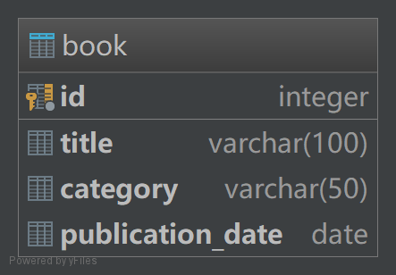

# vertx-postgresql-starter

This is a starter to build a [monolithic](http://microservices.io/patterns/monolithic.html) CRUD RESTful Web Service with [Vert.x](http://vertx.io/) stack and [postgreSQL](https://www.postgresql.org/).
It leverages [Gradle](https://gradle.org/) to build and [Docker](https://www.docker.com/) to boost deployment.

## Prerequisites

* JDK 8+
* Docker
* Docker-compose

## Build

##### 1. Git clone this repo

`git clone https://github.com/BillyYccc/vertx-postgresql-starter.git $PROJECT_NAME`

##### 2. Go to the directory of the project

`cd $PROJECT_NAME`

##### 3. Generate a fat jar

`./gradlew shadowJar`

After a successful build, a fat jar file is generated in directory `$PROJECT_NAME/build/libs`

## Deployment

##### Just one-key deploy with docker-compose

`docker-compose up --build`

## Project

##### REST API

The project takes an easy example with an mini library, the REST API specification is [here](API_SPEC.md). 

##### Domain Logic
The Domain Logic is organized with [Transaction Script](https://martinfowler.com/eaaCatalog/transactionScript.html).

##### Database Degisn

